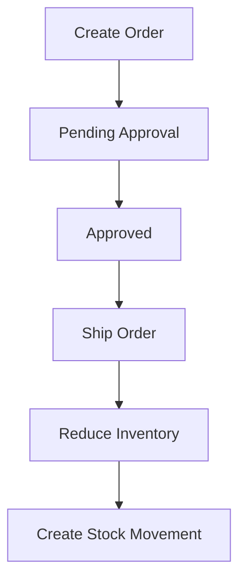

# Mini ERP System

A lightweight ERP system for Sales and Inventory Management.

Built with Laravel 11, PostgreSQL, and Docker.

## Tech Stack

* Laravel 11
* PostgreSQL
* Docker Compose
* Bootstrap 5
* Chart.js

---

## Dashboard

> Dashboard Screenshot Here


---

## Order Workflow



---

## Sample Sales Order

| Field     | Value     |
| --------- | --------- |
| Order No. | SO0001    |
| Customer  | Company A |
| Status    | Approved  |
| Total     | 60,000    |

### Order Items

| Product | Qty | Unit Price | Subtotal |
| ------- | --- | ---------- | -------- |
| Laptop  | 2   | 30,000     | 60,000   |

---

## Stock Movement Example

| Date       | Product | Type | Qty | Balance | Reference |
| ---------- | ------- | ---- | --- | ------- | --------- |
| 2026-06-24 | Laptop  | OUT  | -2  | 18      | SO0001    |

---

## Modules

### Sales Order Module

* Create sales orders
* Order approval workflow
* Order status management

### Inventory Module

* Inventory tracking
* Automatic stock deduction
* Stock movement history

### Dashboard Module

* Revenue statistics
* Order statistics
* Inventory overview

---

## Database ER Diagram

> ER Diagram Screenshot Here


---

## System Architecture

```text
Browser
   │
   ▼
Laravel Application
   │
   ├── Controllers
   ├── Services
   ├── Models
   └── Repositories
   │
   ▼
PostgreSQL
```

### Docker Environment

```text
Docker
├── nginx
├── php-fpm
└── postgres
```

---

## Technical Highlights

* Transaction handling for inventory consistency
* Service Layer architecture
* Approval workflow implementation
* Dockerized development environment
* Dashboard analytics with Chart.js

---

## Installation

```bash
git clone https://github.com/your-account/mini-erp.git

cd mini-erp

cp .env.example .env

docker compose up -d

docker compose exec app composer install

docker compose exec app php artisan key:generate

docker compose exec app php artisan migrate --seed
```

---

## Project Goals

This project simulates a lightweight ERP system focusing on sales and inventory workflows.

Key business scenarios include:

* Sales order management
* Approval workflow
* Inventory deduction
* Stock movement tracking
* Dashboard reporting
